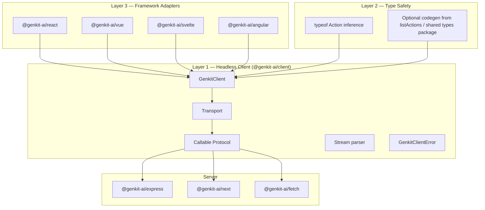
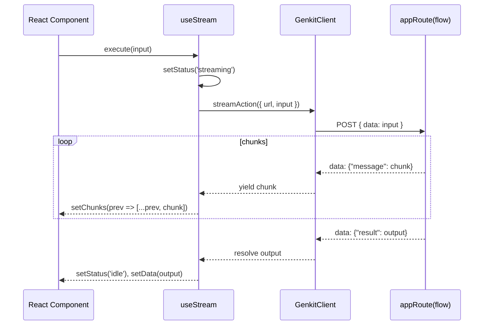

# Genkit Client Experience — Strategic Foundation

> **Status:** Draft · **Audience:** Genkit core team · **Scope:** JavaScript/TypeScript client layer

This document proposes a foundation for Genkit's client-side developer experience: a headless JS client, type-safe invocation of server-defined flows/actions, and framework adapters. It synthesizes the current codebase, the callable protocol, and competitive patterns from Vercel AI SDK UI and TanStack AI.

---

## Executive Summary

Genkit's server-side model is mature: **Actions** are the universal callable unit; **Flows** are the user-facing subset (`actionType: 'flow'`) that most apps expose as HTTP endpoints. The client layer today is a thin beta module (`genkit/beta/client`) with `runFlow` and `streamFlow` — enough to prove the protocol, but not enough to build production UIs without boilerplate.

**Vision:** A three-layer client stack that mirrors Genkit's architecture rather than copying chat-first SDKs wholesale:

| Layer                      | Package (proposed)                                    | Responsibility                                             |
| -------------------------- | ----------------------------------------------------- | ---------------------------------------------------------- |
| **1 — Headless client**    | `@genkit-ai/client`                                   | Transport, protocol, streaming, errors, abort, reconnect   |
| **2 — Type-safe bindings** | `@genkit-ai/client` + shared types / optional codegen | Infer input/output/stream from server `Action` definitions |
| **3 — Framework adapters** | `@genkit-ai/react`, `@genkit-ai/vue`, etc.            | Reactive state hooks built on Layer 1                      |

Genkit is broader than chat: RAG pipelines, structured output, tool/interrupt flows, multi-step agents, and plain request/response APIs all need first-class client primitives. Chat should be a **pattern**, not the **default**.

**Recommended north star:** `runAction` / `streamAction` as canonical APIs, with `runFlow` / `streamFlow` as ergonomic aliases; framework hooks named by capability (`useAction`, `useStream`, `useChat`, `useObject`) rather than by transport.

---

## Current State

### What exists today

#### Headless client (`genkit/beta/client`)

The client lives at `js/genkit/src/client/client.ts` and exports two functions:

- **`runFlow`** — non-streaming POST, expects `{ result: O }` or `{ error }` JSON body
- **`streamFlow`** — streaming POST with `Accept: text/event-stream`, parses SSE-style chunks delimited by `\n\n`, yields `{ message }` chunks and resolves `{ result }`

Both accept `{ url, input, headers, abortSignal }`. Streaming additionally supports durable reconnect via `streamId` / `x-genkit-stream-id`.

```typescript
// Current API surface (simplified)
runFlow<O>({ url, input?, headers?, abortSignal? }): Promise<O>
streamFlow<O, S>({ url, input?, streamId?, headers?, abortSignal? }): {
  output: Promise<O>;
  stream: AsyncIterable<S>;
  streamId: Promise<string | null>;
}
```

The module is marked **beta** (`genkit/beta/client`) and described as "browser-safe" — it uses only `fetch` and `@genkit-ai/core/async` (`Channel`, `createTask`).

#### Type-safe wrapper (`@genkit-ai/next/client`)

The Next.js plugin adds generic inference from a server `Action`:

```typescript
// js/plugins/next/src/client.ts
runFlow<A extends Action>(req: RequestData<Input<A>>): Promise<Output<A>>
streamFlow<A extends Action>(req: RequestData<Input<A>>): StreamResponse<A>
```

This pattern — `runFlow<typeof myFlow>` — is the **only** type-safety story today. It requires the frontend to import the server flow definition (works in monorepos / Next.js colocated apps, breaks for separate client bundles unless types are shared).

#### Server-side HTTP exposure

Multiple plugins expose Actions over HTTP using the **callable protocol**:

| Plugin               | Handler                                                  | Notes                                     |
| -------------------- | -------------------------------------------------------- | ----------------------------------------- |
| `@genkit-ai/express` | `expressHandler(action)`                                 | Production flow server; `startFlowServer` |
| `@genkit-ai/next`    | `appRoute(action)`                                       | App Router route handlers                 |
| `@genkit-ai/fetch`   | `fetchHandler(action)`, `fetchHandlers(actions, prefix)` | Workers, Hono, edge runtimes              |

All use the same wire format:

- **Request:** `POST`, body `{ "data": <input> }`
- **Non-stream response:** `{ "result": <output> }` or callable error JSON
- **Stream response:** chunked, `data: {"message": <chunk>}\n\n` … `data: {"result": <output>}\n\n`
- **Durable stream:** `x-genkit-stream-id` header; reconnect with same header

The fetch plugin explicitly documents that clients call `POST /api/<actionName>` — not only flows.

#### Dev-time protocol (separate from production client)

During development, the **reflection server** exposes `/api/runAction`:

```json
POST /api/runAction?stream=true
{ "key": "/flow/menuSuggestion", "input": { ... }, "context": { ... } }
```

This uses a **different streaming format** (newline-delimited JSON chunks, not SSE-style `data:` prefixes). The Dev UI and `genkit-tools` manager consume this protocol; the browser client does **not** target it today.

#### Sample app patterns

Framework samples hand-roll UI state around the raw client:

- **Next.js** (`js/testapps/next/src/app/page.tsx`): manual `useState`, async functions calling `runFlow` / `streamFlow`
- **Angular** (`js/testapps/angular/src/app/app.ts`): signals + try/catch around client calls
- **Chatbot** (`samples/js-chatbot/...`): `streamFlow` with custom message/toolRequest schemas — no `useChat`

There are **no** official React/Vue/Svelte/Angular hooks for Genkit client-side usage.

### Gaps and pain points

| Gap                                     | Impact                                                                                                                             |
| --------------------------------------- | ---------------------------------------------------------------------------------------------------------------------------------- |
| **Beta-only, flow-named APIs**          | `runFlow` implies flows only, but `fetchHandler`/`expressHandler` accept any Action; naming confuses the mental model              |
| **No structured error type on client**  | Server emits `HttpErrorWireFormat` (`status`, `message`, `details`); client throws plain `Error` strings (see TODO in `client.ts`) |
| **No framework hooks**                  | Every app reimplements loading/error/abort/stream accumulation                                                                     |
| **Type safety requires server imports** | No standalone client codegen; separate-repo frontends get `any`                                                                    |
| **Two streaming protocols**             | Dev (`/api/runAction`) vs prod (callable SSE) — client only speaks prod                                                            |
| **No transport abstraction**            | URL + headers passed ad hoc; no plugin for auth refresh, base URL, tracing headers                                                 |
| **Chat is manual**                      | Tool calls, interrupts, multi-turn state not abstracted despite rich server support                                                |
| **No retry/reconnect policy**           | Durable streaming has reconnect primitive; no built-in retry for transient errors                                                  |
| **Stream chunk typing is loose**        | `streamFlow<Menu, MenuItem>` requires casts in Angular sample due to union inference                                               |

---

## Terminology & Naming

### Official Genkit vocabulary

From the core codebase:

| Term                  | Definition                                                                                                       | Registry `actionType`                                        |
| --------------------- | ---------------------------------------------------------------------------------------------------------------- | ------------------------------------------------------------ |
| **Action**            | "Self-describing, validating, observable, locally and remotely callable function" (`js/core/src/action.ts`)      | `flow`, `tool`, `tool.v2`, `model`, `prompt`, `retriever`, … |
| **Flow**              | "Observable, streamable, (optionally) strongly typed function" — a **subtype of Action** (`js/core/src/flow.ts`) | `flow`                                                       |
| **Tool**              | Model-invokable function                                                                                         | `tool` / `tool.v2`                                           |
| **Callable protocol** | HTTP wire format for remote Action invocation                                                                    | —                                                            |
| **Session / Chat**    | Server-side conversation state (`ai.createSession()`, `session.chat()`)                                          | —                                                            |

**Key insight:** `defineFlow` registers an Action with `actionType: 'flow'`. Flows are Actions; not all Actions are flows. HTTP handlers (`expressHandler`, `fetchHandler`, `appRoute`) accept **`Action`**, not `Flow` specifically.

### Recommended canonical terms

| Context                                     | Use                                                   | Avoid                                              |
| ------------------------------------------- | ----------------------------------------------------- | -------------------------------------------------- |
| **Public docs / app developer API**         | **Flow** for endpoints users define with `defineFlow` | Calling everything an "action" in user-facing docs |
| **Client library internals / generic APIs** | **Action** for protocol-level invoke/stream           | —                                                  |
| **Wire protocol**                           | **Callable protocol**                                 | "REST API", "flow protocol"                        |
| **Dev tooling**                             | **runAction** (matches reflection API)                | —                                                  |

### API naming recommendation

```
Canonical (generic)     User-facing alias (flows)     Purpose
─────────────────────────────────────────────────────────────────
runAction               runFlow                       Non-streaming invoke
streamAction            streamFlow                    Streaming invoke
createActionClient      createFlowClient              Client factory (optional alias)
useAction               useFlow (deprecated alias)    Framework hook
```

**Rationale:**

- **`runAction` / `streamAction`** align with reflection server, `fetchHandler`, and the Action abstraction — future-proof if users expose tools or prompts over HTTP.
- **`runFlow` / `streamFlow`** remain as aliases for backward compatibility and match existing docs/samples.
- Framework hooks should prefer **`useAction`** — a menu generator, RAG query, or agent step is not a "flow" in the user's mental model of UI state, but it _is_ an action invocation.

### Hook naming (framework layer)

| Hook                | When to use                                                                                               |
| ------------------- | --------------------------------------------------------------------------------------------------------- |
| **`useAction`**     | Generic invoke: loading, error, result, `execute(input)`, abort                                           |
| **`useStream`**     | Streaming invoke: chunks, final output, abort, optional reconnect                                         |
| **`useChat`**       | Multi-turn **message-list** UX where input/output are chat-shaped (roles, parts, tool requests/responses) |
| **`useObject`**     | Structured output: stream partial JSON/objects into typed state                                           |
| **`useCompletion`** | Single text prompt → streamed/completed text (thin wrapper over `useStream` for string output)            |

**Do not** make `useChat` the default entry point. Most Genkit samples are flows, not chat endpoints.

---

## Architecture Proposal

### Layer diagram



### Layer 1: Headless JS client

**Package:** `@genkit-ai/client` (extract from `genkit/beta/client`, graduate from beta)

**Core types:**

```typescript
interface GenkitClientOptions {
  baseUrl?: string;
  transport?: Transport;
  headers?: HeadersInit | (() => HeadersInit | Promise<HeadersInit>);
  fetch?: typeof fetch;
}

interface RunActionRequest<TInput = unknown> {
  /** Action endpoint path or full URL, e.g. '/api/menuSuggestion' */
  url: string;
  input?: TInput;
  abortSignal?: AbortSignal;
}

interface StreamActionRequest<TInput = unknown>
  extends RunActionRequest<TInput> {
  /** Reconnect to durable stream */
  streamId?: string;
}

interface StreamActionResult<TOutput, TChunk> {
  output: Promise<TOutput>;
  stream: AsyncIterable<TChunk>;
  streamId: Promise<string | null>;
  abort: () => void;
}
```

**Responsibilities:**

1. **Transport abstraction** — pluggable `Transport` interface (like AI SDK's `ChatTransport`):
   - `CallableTransport` (default) — POST `{ data }` to URL
   - Future: `ReflectionTransport` for dev-only `/api/runAction` with `key`
2. **Protocol parsing** — unify stream parsing; normalize error payloads into `GenkitClientError`
3. **Cross-cutting concerns** — abort, optional retry, trace header propagation (`x-genkit-trace-id`)
4. **Zero framework deps** — works in Node 18+, browsers, Workers

**Error handling:**

Parse server `HttpErrorWireFormat` into a typed error:

```typescript
class GenkitClientError extends Error {
  readonly status: StatusName; // e.g. 'PERMISSION_DENIED', 'INVALID_ARGUMENT'
  readonly details?: unknown;
  readonly traceId?: string;
}
```

This mirrors `GenkitError` / `getCallableJSON` on the server (`js/core/src/error.ts`) and fixes the current client TODO.

### Layer 2: Type-safe client

**Strategy A — Inference (zero codegen, works today):**

Continue the `@genkit-ai/next/client` pattern globally:

```typescript
import type { menuFlow } from '@/server/flows';
import { runAction } from '@genkit-ai/client';

const menu = await runAction<typeof menuFlow>({
  url: '/api/menuSuggestion',
  input: { theme: 'seafood' },
});
// menu: z.infer<typeof menuFlow.__action.outputSchema>
```

Requires sharing the `Action` type (monorepo, or a `shared/` types package exporting flow references without server code).

**Strategy B — Codegen (separate client repo):**

CLI command (e.g. `genkit client:generate`) that:

1. Calls reflection `listActions` or reads a static manifest
2. Emits a `genkit-client.d.ts` or typed endpoint map:

```typescript
// generated
export interface GenkitActions {
  menuSuggestion: ActionFn<
    { theme: string | null },
    Menu,
    MenuItem // stream chunk
  >;
}
```

3. Client uses `runAction<GenkitActions['menuSuggestion']>(...)`

**Strategy C — Schema-at-runtime (optional):**

For dynamic UIs (Dev UI-style), fetch action schemas from reflection and validate with Zod at runtime. Type safety is partial; useful for tooling, not primary app DX.

**Recommendation:** Ship Strategy A in v1; design codegen (Strategy B) as Phase 2 for split frontend/backend repos.

### Layer 3: Framework adapters

Each adapter wraps Layer 1 with reactive state. Shared headless logic lives in `@genkit-ai/client/react` (or `@genkit-ai/client/internal`) to avoid duplicating stream lifecycle across frameworks.



**Package structure (proposed under `js/`):**

```
js/
  client/                    # @genkit-ai/client (headless)
  plugins/
    react/                   # @genkit-ai/react (useAction, useStream, useChat, useObject)
    vue/
    svelte/
    angular/
```

Alternatively, framework adapters could live as subpath exports: `@genkit-ai/client/react`. Match whichever pattern the team prefers for `@genkit-ai/next` consistency.

---

## Primitive Design

### Decision matrix: which primitive?

| Use case                       | Server pattern                        | Client primitive              | Framework hook                   |
| ------------------------------ | ------------------------------------- | ----------------------------- | -------------------------------- |
| One-shot structured output     | `defineFlow` with `outputSchema`      | `runAction`                   | `useAction`                      |
| Progressive structured output  | flow + `sendChunk` partial objects    | `streamAction`                | `useObject`                      |
| Text streaming                 | flow + `sendChunk(string)`            | `streamAction`                | `useStream` or `useCompletion`   |
| Multi-turn chat with tools     | flow accepting message + toolResponse | `streamAction`                | `useChat`                        |
| Long-running stream, reconnect | flow + `StreamManager`                | `streamAction({ streamId })`  | `useStream({ reconnect: true })` |
| Agent with interrupts          | flow + interrupt/resume protocol      | `streamAction` + resume input | `useChat` with interrupt state   |
| Non-AI utility flow            | plain `defineFlow`                    | `runAction`                   | `useAction`                      |

### Streaming vs non-streaming

**Non-streaming (`runAction`):**

- Simple request/response
- Use when latency is acceptable and no incremental UI
- Client sets `Content-Type: application/json`, no `Accept: text/event-stream`

**Streaming (`streamAction`):**

- Server detects stream via `Accept: text/event-stream` header or `?stream=true` query (Express/Next)
- Client exposes `AsyncIterable` for chunks + `Promise` for final output
- **Important:** chunk type comes from flow's `streamSchema`; output type from `outputSchema`. These may differ (see Angular menu sample)

**Durable streaming:**

- Server returns `x-genkit-stream-id`
- Client stores ID; on disconnect, call `streamAction({ streamId })` without `input`
- Framework hook should expose `reconnect()` and persist `streamId` (localStorage, URL param)

### Error handling, abort, retry

| Concern                     | Headless behavior                                               | Hook behavior                                                                            |
| --------------------------- | --------------------------------------------------------------- | ---------------------------------------------------------------------------------------- |
| **Abort**                   | Pass `AbortSignal`; abort fetch                                 | `abort()` cancels in-flight; reset or preserve partial stream (configurable)             |
| **Errors**                  | Throw `GenkitClientError` with `status`, `details`              | Surface `error` state; map `PERMISSION_DENIED` → auth redirect hook                      |
| **Retry**                   | Optional `retry: { maxAttempts, retryOn: StatusName[] }`        | `retry()` function; auto-retry only for idempotent `runAction` unless explicitly enabled |
| **User-facing vs internal** | Pass through server `status`; never leak stack to UI by default | Show generic message; log `details.stack` in dev                                         |

### Chat is a pattern, not the protocol

Genkit chat on the server (`session.chat()`) manages history server-side. Client chat UIs typically:

1. Call a **flow** that accepts `{ role, text, toolResponse? }` and returns `{ role, text, toolRequest? }`
2. Maintain **message list state** on the client
3. Stream partial text via `sendChunk`

`useChat` should:

- Manage `messages[]`, `input`, `isLoading`, `error`
- Support **Genkit tool request/response** shapes (see chatbot sample schemas)
- Support **interrupt/resume** by accepting resume payloads in the next `sendMessage`
- **Not** assume OpenAI message format — provide adapters if needed

For apps using OpenAI-compatible message shapes internally, offer optional normalizers — but the default should match Genkit's native message/part model.

---

## Competitive Analysis

| Dimension                | Genkit (proposed)                                                     | Vercel AI SDK UI                                                 | TanStack AI                                             |
| ------------------------ | --------------------------------------------------------------------- | ---------------------------------------------------------------- | ------------------------------------------------------- |
| **Primary abstraction**  | Callable Action/Flow over HTTP                                        | Chat/completion/object generation hooks                          | Chat + isomorphic tools                                 |
| **Scope**                | Full Genkit surface (flows, tools, RAG, agents, structured output)    | LLM provider interactions; UI for chat/completion/object         | LLM provider + tool loop                                |
| **Headless client**      | `@genkit-ai/client` (proposed)                                        | `ai` package core; UI separate                                   | `@tanstack/ai-client`                                   |
| **Framework hooks**      | `useAction`, `useStream`, `useChat`, `useObject`                      | `useChat`, `useCompletion`, `useObject`                          | `useChat` (React/Solid)                                 |
| **Transport**            | Callable HTTP + optional reflection (proposed)                        | `DefaultChatTransport`, custom transports, `DirectChatTransport` | Connection adapters (SSE, HTTP stream)                  |
| **Type safety**          | `typeof Action` inference + optional codegen                          | Schema helpers, `useObject` with Zod                             | `toolDefinition()` + Zod inference, `InferChatMessages` |
| **Tool calling UX**      | Server-side in flow; client sees toolRequest/toolResponse in stream   | First-class `useChat` tool UI, generative UI                     | Isomorphic tools, approval flow built-in                |
| **Streaming reconnect**  | `StreamManager` + `streamId` (server exists; client primitive exists) | Stream resume (chat persistence docs)                            | Connection adapter dependent                            |
| **Provider coupling**    | None — client talks to _your_ Genkit server                           | Tightly coupled to LLM providers                                 | Tightly coupled to LLM providers                        |
| **Non-chat first-class** | Yes — `useAction`, `useObject`                                        | Partial — `useCompletion`, `useObject`                           | Mostly chat-centric hooks                               |

**What to adopt:**

- **Transport abstraction** (AI SDK) — decouple URL/auth/body from hook logic
- **Headless client package** (TanStack `@tanstack/ai-client`) — share logic across frameworks
- **Typed error + retry surface** (both) — structured hook error state
- **Multiple hooks by capability** (AI SDK's split of chat/completion/object) — maps well to Genkit's diverse flows

**What to avoid:**

- Making the client LLM-provider-aware — Genkit's value is server-side composition
- Collapsing everything into `useChat` — most Genkit flows are not chat-shaped
- Copying OpenAI message types as the only interface — Genkit has its own tool/interrupt/message model

---

## Recommended Starting Point

> **Implementation plan:** See [js-client/DEVELOPMENT.md](./js-client/DEVELOPMENT.md) for the step-by-step build plan, workspace layout, test strategy, and phase checklists.

### Phase 0 — Foundation hardening (4–6 weeks)

**Goal:** Production-quality headless client, backward compatible.

1. **Extract `@genkit-ai/client`** from `genkit/beta/client`
   - Add `runAction` / `streamAction` as canonical names
   - Keep `runFlow` / `streamFlow` as deprecated aliases
2. **Implement `GenkitClientError`** parsing `HttpErrorWireFormat`
3. **Add `CallableTransport`** with `baseUrl`, dynamic headers, custom `fetch`
4. **Unify stream parser** — single module, tested against Express/Next/Fetch handler output
5. **Document callable protocol** in repo (link from client README)
6. **Graduate from beta** once API stable

**MVP scope:** Feature parity with today's `runFlow`/`streamFlow` + typed errors + transport. No framework hooks yet.

### Phase 1 — React adapter + type inference (4–6 weeks)

**Goal:** First framework DX win, validate hook design.

1. **`@genkit-ai/react`** with:
   - `useAction<A extends Action>()`
   - `useStream<A extends Action>()`
   - `GenkitClientProvider` for shared client instance
2. **Promote type inference** from `@genkit-ai/next/client` into `@genkit-ai/client`
3. **Refactor** `js/testapps/next` and `js/testapps/angular` samples to use hooks (Angular can wait for Phase 2)
4. **`useChat` prototype** against `samples/js-chatbot` flow shape

### Phase 2 — Codegen + additional frameworks (6–8 weeks)

1. **`genkit client:generate`** — typed endpoint map from reflection
2. **`useObject`** for structured streaming (Zod-validated partial output)
3. **Vue + Svelte adapters** (minimal — mirror React headless usage)
4. **Durable stream UX** — `useStream({ persistStreamId: 'localStorage' })`, auto-reconnect

### Phase 3 — Advanced patterns (ongoing)

1. **Interrupt/resume** in `useChat`
2. **ReflectionTransport** for dev-only client tooling
3. **Angular signals adapter** (`@genkit-ai/angular`)
4. **Testing utilities** — mock transport, stream fixtures

---

## Example API Sketches

### Headless client

```typescript
import { createGenkitClient, GenkitClientError } from '@genkit-ai/client';
import type { menuFlow } from '@/genkit/flows';

const client = createGenkitClient({
  baseUrl: '',
  headers: () => ({
    Authorization: `Bearer ${getToken()}`,
  }),
});

// Non-streaming
try {
  const menu = await client.runAction<typeof menuFlow>({
    url: '/api/menuSuggestion',
    input: { theme: 'italian' },
  });
} catch (e) {
  if (e instanceof GenkitClientError && e.status === 'PERMISSION_DENIED') {
    redirectToLogin();
  }
}

// Streaming
const { stream, output, abort, streamId } = client.streamAction<
  typeof menuFlow
>({
  url: '/api/menuSuggestion',
  input: { theme: 'italian' },
});

for await (const item of stream) {
  appendMenuItem(item); // typed as streamSchema chunk
}
const finalMenu = await output;
const id = await streamId; // for reconnect
```

### React — generic action

```typescript
'use client';
import { useAction } from '@genkit-ai/react';
import type { menuFlow } from '@/genkit/flows';

function MenuGenerator() {
  const { execute, data, error, isLoading } = useAction<typeof menuFlow>({
    url: '/api/menuSuggestion',
  });

  return (
    <div>
      <button
        disabled={isLoading}
        onClick={() => execute({ theme: 'seafood' })}
      >
        Generate
      </button>
      {error && <p>Something went wrong.</p>}
      {data && <MenuView menu={data} />}
    </div>
  );
}
```

### React — streaming structured output

```typescript
'use client';
import { useStream } from '@genkit-ai/react';
import type { menuFlow } from '@/genkit/flows';

function StreamingMenu() {
  const { execute, chunks, data, isStreaming, abort } = useStream<
    typeof menuFlow
  >({
    url: '/api/menuSuggestion',
  });

  return (
    <div>
      <button onClick={() => execute({ theme: 'bbq' })}>Stream menu</button>
      {isStreaming && <button onClick={abort}>Stop</button>}
      <ul>
        {chunks.map((item, i) => (
          <li key={i}>{item.name}</li>
        ))}
      </ul>
      {data && <p>{data.restaurantName}</p>}
    </div>
  );
}
```

### React — chat-shaped flow

```typescript
'use client';
import { useChat } from '@genkit-ai/react';
import type { chatbotFlow } from '@/genkit/flows';

function Chatbot() {
  const {
    messages,
    input,
    setInput,
    sendMessage,
    isLoading,
    error,
    toolRequests, // pending tool approvals
    respondToTool,
  } = useChat<typeof chatbotFlow>({
    url: '/api/chatbotFlow',
    // Initial messages optional
  });

  return (
    <div>
      {messages.map((m) => (
        <Message key={m.id} message={m} />
      ))}
      {toolRequests?.map((tr) => (
        <ToolApproval key={tr.ref} request={tr} onRespond={respondToTool} />
      ))}
      {error && <ErrorBanner />}
      <form
        onSubmit={(e) => {
          e.preventDefault();
          sendMessage({ text: input });
          setInput('');
        }}
      >
        <input value={input} onChange={(e) => setInput(e.target.value)} />
        <button disabled={isLoading}>Send</button>
      </form>
    </div>
  );
}
```

### Custom transport (auth refresh)

```typescript
import { CallableTransport, createGenkitClient } from '@genkit-ai/client';

const transport = new CallableTransport({
  baseUrl: process.env.NEXT_PUBLIC_API_URL,
  prepareRequest: async ({ url, input, stream }) => {
    const token = await getRefreshedToken();
    return {
      url,
      init: {
        method: 'POST',
        headers: {
          'Content-Type': 'application/json',
          ...(stream ? { Accept: 'text/event-stream' } : {}),
          Authorization: `Bearer ${token}`,
        },
        body: JSON.stringify({ data: input }),
      },
    };
  },
});

const client = createGenkitClient({ transport });
```

---

## Open Questions

1. **Package naming:** `@genkit-ai/client` vs keeping `genkit/client` subpath — subpath avoids new package but couples client release to main `genkit` package.
2. **Stable vs beta graduation:** Should framework adapters ship under `@genkit-ai/react` stable while client is beta, or wait for unified GA?
3. **Reflection protocol in browser client:** Useful for Dev UI embedding, or keep dev-only tooling separate?
4. **Message schema standardization:** Should `useChat` enforce a Genkit canonical message type, or accept generic `Action` input/output and let each app define shape?
5. **Non-flow Actions over HTTP:** Document and support calling exposed tools/models directly, or intentionally scope client to flows only?

---

## References (codebase)

| Resource                        | Path                                                          |
| ------------------------------- | ------------------------------------------------------------- |
| Current client                  | `js/genkit/src/client/client.ts`                              |
| Type-safe Next wrapper          | `js/plugins/next/src/client.ts`                               |
| Callable HTTP handler (Express) | `js/plugins/express/src/index.ts`                             |
| Callable HTTP handler (Fetch)   | `js/plugins/fetch/src/index.ts`                               |
| Action / Flow definitions       | `js/core/src/action.ts`, `js/core/src/flow.ts`                |
| Error wire format               | `js/core/src/error.ts`                                        |
| Dev reflection protocol         | `js/core/src/reflection.ts`, `docs/reflection-v2-protocol.md` |
| Next.js sample (manual client)  | `js/testapps/next/src/app/page.tsx`                           |
| Angular sample (manual client)  | `js/testapps/angular/src/app/app.ts`                          |
| Chatbot sample (tool messages)  | `samples/js-chatbot/genkit-app/.../chatbot.component.ts`      |

## References (external)

- [Vercel AI SDK UI Overview](https://ai-sdk.dev/docs/ai-sdk-ui/overview)
- [Vercel AI SDK Transport](https://ai-sdk.dev/docs/ai-sdk-ui/transport)
- [Vercel AI SDK Error Handling](https://ai-sdk.dev/docs/ai-sdk-ui/error-handling)
- [TanStack AI Overview](https://tanstack.com/ai/latest/docs/getting-started/overview)
- [Genkit Callable Protocol (Firebase docs)](https://firebase.google.com/docs/genkit/reference/js/client)
