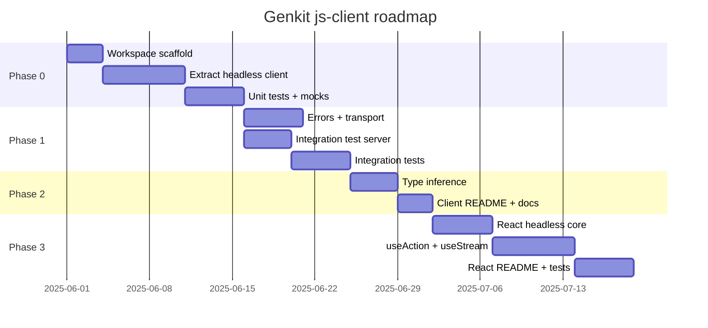

# Genkit Client — Phased Development Plan

> **Status:** Active · **Workspace:** `js-client/` · **Foundation:** [CLIENT.md](../CLIENT.md)

This document is the step-by-step implementation plan for the Genkit client stack: headless JS client → React integration. Each phase has concrete deliverables, file targets, test requirements, README sections, and exit criteria.

---

## Overview



| Phase | Duration (est.) | Outcome |
| --- | --- | --- |
| **0** | 1–2 weeks | Workspace + headless client with unit tests |
| **1** | 1–2 weeks | Structured errors, transport, Hono integration tests |
| **2** | 1 week | Type inference + client README/docs |
| **3** | 2 weeks | React hooks (`useAction`, `useStream`) + tests |

---

## Workspace layout

```
js-client/
├── README.md
├── DEVELOPMENT.md                 ← this file
├── pnpm-workspace.yaml
├── package.json
├── tsconfig.base.json
├── packages/
│   ├── client/                    @genkit-ai/client
│   │   ├── README.md
│   │   ├── package.json
│   │   ├── tsconfig.json
│   │   ├── tsup.config.ts
│   │   ├── src/
│   │   │   ├── index.ts
│   │   │   ├── client.ts          createGenkitClient, runAction, streamAction
│   │   │   ├── errors.ts          GenkitClientError
│   │   │   ├── protocol/
│   │   │   │   ├── parse-stream.ts
│   │   │   │   └── parse-response.ts
│   │   │   ├── transport/
│   │   │   │   ├── types.ts
│   │   │   │   └── callable-transport.ts
│   │   │   └── types/
│   │   │       └── action.ts      Input<A>, Output<A>, Stream<A>
│   │   └── tests/
│   │       ├── unit/
│   │       │   ├── parse-stream_test.ts
│   │       │   ├── parse-response_test.ts
│   │       │   ├── errors_test.ts
│   │       │   └── mock-transport.ts
│   │       └── integration/
│   │           ├── server.ts      starts integration/server
│   │           └── client_test.ts
│   └── react/                     @genkit-ai/react
│       ├── README.md
│       ├── package.json
│       ├── tsconfig.json
│       ├── tsup.config.ts
│       ├── src/
│       │   ├── index.ts
│       │   ├── context.tsx        GenkitClientProvider
│       │   ├── internal/
│       │   │   └── stream-state.ts  shared headless stream lifecycle
│       │   ├── use-action.ts
│       │   └── use-stream.ts
│       └── tests/
│           ├── setup.ts           @testing-library/react + jsdom
│           ├── use-action_test.tsx
│           └── use-stream_test.tsx
└── integration/
    └── server/                    @genkit-ai/client-test-server
        ├── package.json
        ├── tsconfig.json
        └── src/
            ├── index.ts           Hono app + fetchHandlers
            └── flows.ts           deterministic test flows (no LLM)
```

---

## Phase 0 — Workspace scaffold + headless client MVP

**Goal:** Extract a production-quality headless client from `js/genkit/src/client/client.ts` into `@genkit-ai/client`, with unit tests and backward-compatible aliases.

### Step 0.1 — Workspace bootstrap ✅

- [x] Create `js-client/` pnpm workspace at repo root
- [x] Add `packages/client`, `packages/react`, `integration/server` package stubs
- [x] Configure `tsconfig.base.json`, root scripts (`build`, `test`, `test:unit`, `test:integration`)

**pnpm workspace link to main `js/`:**

Add to `js-client/package.json`:

```json
{
  "pnpm": {
    "overrides": {
      "genkit": "link:../js/genkit",
      "@genkit-ai/core": "link:../js/core",
      "@genkit-ai/fetch": "link:../js/plugins/fetch"
    }
  }
}
```

### Step 0.2 — Extract core client API

**Source of truth:** `js/genkit/src/client/client.ts`

**Implement in `packages/client/src/`:**

| Module | Responsibility |
| --- | --- |
| `protocol/parse-stream.ts` | Parse SSE-style `data: {...}\n\n` chunks; yield `message`, `result`, or throw on `error` |
| `protocol/parse-response.ts` | Parse non-stream `{ result }` / `{ error }` JSON |
| `client.ts` | `runAction`, `streamAction`, `createGenkitClient` |
| `index.ts` | Public exports + deprecated `runFlow`/`streamFlow` aliases |

**API surface (Phase 0):**

```typescript
// packages/client/src/index.ts
export { createGenkitClient, runAction, streamAction } from './client.js';
export { runFlow, streamFlow } from './aliases.js'; // deprecated, re-export runAction/streamAction
export type { RunActionRequest, StreamActionResult, GenkitClientOptions } from './client.js';
```

**Behavior parity checklist** (must match existing client):

- [ ] POST body `{ data: input }`
- [ ] Stream: `Accept: text/event-stream` header
- [ ] Stream delimiter `\n\n`, strip `data: ` prefix
- [ ] Durable stream: `x-genkit-stream-id` header on request/response
- [ ] 204 → `NOT_FOUND: Stream not found`
- [ ] Non-200 → throw with status + body text
- [ ] `abortSignal` forwarded to fetch
- [ ] `streamAction` returns `{ output, stream, streamId }` using `Channel` from `@genkit-ai/core/async`

**Dependencies:**

```json
{
  "dependencies": {
    "@genkit-ai/core": "workspace:*"
  },
  "peerDependencies": {
    "genkit": "workspace:^"
  },
  "peerDependenciesMeta": {
    "genkit": { "optional": true }
  }
}
```

`genkit` is optional at runtime (browser client only needs `@genkit-ai/core/async`); required as peer for type inference in Phase 2.

### Step 0.3 — Unit tests (mocks)

**Location:** `packages/client/tests/unit/`

**Mock transport** (`mock-transport.ts`):

```typescript
export class MockTransport implements Transport {
  constructor(private readonly handlers: Record<string, (req: RequestInit) => Response | Promise<Response>>) {}
  async fetch(url: string, init: RequestInit): Promise<Response> {
    const handler = this.handlers[url] ?? this.handlers['*'];
    if (!handler) throw new Error(`No mock handler for ${url}`);
    return handler(init);
  }
}
```

**Test files:**

| File | Cases |
| --- | --- |
| `parse-stream_test.ts` | Single chunk; multi-chunk buffer; partial delimiter; `message`/`result`/`error` chunks; unknown format |
| `parse-response_test.ts` | `{ result }` success; `{ error: string }`; `{ error: HttpErrorWireFormat }` |
| `client_test.ts` | `runAction` happy path via MockTransport; stream yields messages then resolves output; abort cancels |

**Run:**

```bash
pnpm --filter @genkit-ai/client test:unit
# node --import tsx --test tests/unit/*_test.ts
```

### Phase 0 exit criteria

- [ ] `@genkit-ai/client` builds with tsup (CJS + ESM + d.ts)
- [ ] Unit tests pass with zero network I/O
- [ ] API is backward compatible with `genkit/beta/client` (`runFlow`/`streamFlow` work)
- [ ] No framework dependencies

---

## Phase 1 — Errors, transport abstraction, integration tests

**Goal:** Structured errors, pluggable transport, and end-to-end tests against a real Genkit Hono server.

### Step 1.1 — `GenkitClientError`

**Source:** `js/core/src/error.ts` (`HttpErrorWireFormat`, `StatusName`)

**Implement `packages/client/src/errors.ts`:**

```typescript
export class GenkitClientError extends Error {
  readonly status: StatusName;
  readonly details?: unknown;
  readonly httpStatus?: number;
  readonly traceId?: string;

  static fromWire(error: HttpErrorWireFormat, response?: Response): GenkitClientError;
  static fromResponse(response: Response, body: string): GenkitClientError;
}
```

**Wire format handling:**

- Stream error chunk: `{ error: { status, message, details } }`
- Non-stream: `{ error: string }` or `{ error: HttpErrorWireFormat }`
- Parse `x-genkit-trace-id` from response headers when present

**Unit tests:** `errors_test.ts` — all StatusName values, string vs object error, trace header extraction.

### Step 1.2 — `CallableTransport`

**Implement `packages/client/src/transport/`:**

```typescript
export interface Transport {
  request(options: TransportRequest): Promise<Response>;
}

export interface TransportRequest {
  url: string;
  input?: unknown;
  stream?: boolean;
  streamId?: string;
  abortSignal?: AbortSignal;
  headers?: Record<string, string>;
}

export class CallableTransport implements Transport {
  constructor(options: {
    baseUrl?: string;
    fetch?: typeof fetch;
    headers?: HeadersInit | (() => HeadersInit | Promise<HeadersInit>);
  });
}
```

`createGenkitClient({ transport })` uses transport for all calls. Default transport is `CallableTransport`.

**Unit tests:** baseUrl prefixing, dynamic headers callback, stream vs non-stream header sets.

### Step 1.3 — Integration test server (Hono + fetch)

**Location:** `integration/server/`

Deterministic flows — **no LLM, no API keys**:

| Flow | Input | Output | Stream chunks |
| --- | --- | --- | --- |
| `echo` | `{ text: string }` | `{ text: string }` | — |
| `add` | `{ a: number, b: number }` | `{ sum: number }` | — |
| `countStream` | `{ to: number }` | `{ count: number }` | `number` (1..to) |
| `secureEcho` | `{ text: string }` | `{ text: string }` | — (requires `Authorization: Bearer test-token`) |
| `failWithStatus` | `{ status: StatusName }` | — | throws `UserFacingError` |

**Server setup** (based on `js/testapps/hono/src/index.ts`):

```typescript
import { fetchHandlers, withActionOptions } from '@genkit-ai/fetch';
import { Hono } from 'hono';
import { serve } from '@hono/node-server';
import { flows } from './flows.js';

const app = new Hono();
app.all('/api/*', (c) => fetchHandlers(flows, '/api')(c.req.raw));
export { app, startTestServer }; // startTestServer(port?) for tests
```

**Export a programmatic API** for tests:

```typescript
// integration/server/src/index.ts
export async function startTestServer(): Promise<{ url: string; close: () => void }>;
```

Use `get-port` for ephemeral port allocation (pattern from `js/plugins/fetch/tests/web_test.ts`).

### Step 1.4 — Integration tests

**Location:** `packages/client/tests/integration/client_test.ts`

**Harness:**

```typescript
import { before, after } from 'node:test';
import { startTestServer } from '@genkit-ai/client-test-server';

let baseUrl: string;
let close: () => void;

before(async () => {
  ({ url: baseUrl, close } = await startTestServer());
});
after(() => close());
```

**Test cases:**

| Test | Validates |
| --- | --- |
| `runAction echo` | Non-stream round-trip |
| `runAction add` | Typed JSON input/output |
| `streamAction countStream` | Chunk sequence + final output |
| `streamAction abort mid-stream` | AbortSignal stops fetch |
| `runAction secureEcho without auth` | `GenkitClientError` with `PERMISSION_DENIED` |
| `runAction failWithStatus` | Error wire format parsing |
| `streamAction reconnect` (optional Phase 1 stretch) | `streamId` header round-trip with `InMemoryStreamManager` |

**Run:**

```bash
pnpm test:integration
# Starts server, runs integration/*_test.ts, shuts down
```

### Phase 1 exit criteria

- [ ] `GenkitClientError` replaces plain `Error` for server errors
- [ ] `CallableTransport` is default; custom transport injectable
- [ ] Integration tests pass against Hono server without external services
- [ ] CI can run `pnpm test` in `js-client/` headlessly

---

## Phase 2 — Type inference + client documentation

**Goal:** Promote the `@genkit-ai/next/client` inference pattern into `@genkit-ai/client` and ship a complete README.

### Step 2.1 — Action type helpers

**Implement `packages/client/src/types/action.ts`:**

```typescript
import type { Action, z } from 'genkit';

export type Input<A extends Action> =
  A extends Action<infer I extends z.ZodTypeAny, any, any> ? z.infer<I> : never;
export type Output<A extends Action> =
  A extends Action<any, infer O extends z.ZodTypeAny, any> ? z.infer<O> : never;
export type StreamChunk<A extends Action> =
  A extends Action<any, any, infer S extends z.ZodTypeAny> ? z.infer<S> : never;
```

**Typed overloads:**

```typescript
export function runAction<A extends Action>(
  req: RunActionRequest<Input<A>>
): Promise<Output<A>>;

export function streamAction<A extends Action>(
  req: StreamActionRequest<Input<A>>
): StreamActionResult<Output<A>, StreamChunk<A>>;
```

**Unit test:** Compile-time test file `tests/types/inference_test.ts` (uses `// @ts-expect-error` and assignability checks; no runtime).

### Step 2.2 — Client README

**Deliverable:** `packages/client/README.md`

**Required sections:**

1. **Installation** — `pnpm add @genkit-ai/client`
2. **Quick start** — `runAction` + `streamAction` examples
3. **API reference** — `createGenkitClient`, request options, return types
4. **Type safety** — `typeof myFlow` inference example
5. **Error handling** — `GenkitClientError`, status codes, example catch block
6. **Streaming** — chunk iteration, abort, durable stream reconnect
7. **Transport** — custom transport, auth headers, base URL
8. **Callable protocol** — wire format summary (link to Firebase docs)
9. **Migration** — from `genkit/beta/client` (`runFlow` → `runAction`)
10. **Testing** — how to use `MockTransport` in app tests

### Step 2.3 — Deprecation path for `genkit/beta/client`

In `js/genkit/src/client/client.ts`:

```typescript
/** @deprecated Use `@genkit-ai/client` runAction instead */
export { runAction as runFlow, streamAction as streamFlow } from '@genkit-ai/client';
```

Or keep inline implementation until `@genkit-ai/client` is published, then switch re-exports.

### Phase 2 exit criteria

- [ ] `runAction<typeof flow>` infers input/output/stream types
- [ ] README covers all public API with runnable examples
- [ ] `@genkit-ai/next/client` can optionally thin-wrap `@genkit-ai/client` (follow-up PR in `js/`)

---

## Phase 3 — React integration

**Goal:** First framework adapter with `useAction` and `useStream`, tested with mock transport and integration server.

### Step 3.1 — Shared headless stream state

**Location:** `packages/react/src/internal/stream-state.ts`

Framework-agnostic state machine used by hooks (mirrors TanStack `@tanstack/ai-client` pattern):

```typescript
export type ActionStatus = 'idle' | 'loading' | 'streaming' | 'error';

export interface StreamState<TChunk, TOutput> {
  status: ActionStatus;
  chunks: TChunk[];
  data: TOutput | undefined;
  error: GenkitClientError | Error | undefined;
  streamId: string | null;
}

export function createStreamExecutor<TInput, TChunk, TOutput>(options: {
  client: GenkitClient;
  url: string;
}): {
  execute: (input?: TInput) => void;
  abort: () => void;
  subscribe: (listener: () => void) => () => void;
  getState: () => StreamState<TChunk, TOutput>;
};
```

This keeps Vue/Svelte adapters (future) from duplicating stream lifecycle logic.

### Step 3.2 — `GenkitClientProvider`

```typescript
'use client'; // documented for Next.js App Router consumers

export const GenkitClientContext = createContext<GenkitClient>(defaultClient);
export function GenkitClientProvider({ client, children }: { client?: GenkitClient; children: ReactNode });
export function useGenkitClient(): GenkitClient;
```

Provider accepts optional `createGenkitClient({ baseUrl, headers })` config.

### Step 3.3 — `useAction`

```typescript
export function useAction<A extends Action>(options: {
  url: string;
  client?: GenkitClient;
}): {
  execute: (input?: Input<A>) => Promise<Output<A>>;
  data: Output<A> | undefined;
  error: Error | undefined;
  isLoading: boolean;
  reset: () => void;
};
```

**Behavior:**

- `execute` sets loading, calls `client.runAction`, updates `data` or `error`
- Concurrent calls: latest wins (abort previous via AbortController)
- `reset` clears state

### Step 3.4 — `useStream`

```typescript
export function useStream<A extends Action>(options: {
  url: string;
  client?: GenkitClient;
}): {
  execute: (input?: Input<A>) => void;
  abort: () => void;
  chunks: StreamChunk<A>[];
  data: Output<A> | undefined;
  error: Error | undefined;
  isStreaming: boolean;
  streamId: string | null;
};
```

**Behavior:**

- Accumulates chunks in state as they arrive
- `abort()` cancels in-flight stream
- Resolves `data` when stream completes

### Step 3.5 — React tests

**Dependencies:**

```json
{
  "devDependencies": {
    "@testing-library/react": "^16.0.0",
    "@testing-library/dom": "^10.0.0",
    "jsdom": "^25.0.0",
    "react": "^19.0.0",
    "react-dom": "^19.0.0"
  },
  "peerDependencies": {
    "react": "^18.0.0 || ^19.0.0",
    "@genkit-ai/client": "workspace:*"
  }
}
```

**Test strategy:**

| File | Approach |
| --- | --- |
| `use-action_test.tsx` | Render hook with `MockTransport`; assert loading → data transitions |
| `use-stream_test.tsx` | Mock stream responses; assert chunk accumulation + final data |
| `use-action.integration_test.tsx` | Optional: render + call against `startTestServer()` |

**Run:**

```bash
node --import tsx --test tests/*_test.tsx
# Requires: NODE_OPTIONS or test runner config for jsx/tsx
```

Consider `@testing-library/react`'s `renderHook` with a wrapper providing `GenkitClientProvider`.

### Step 3.6 — React README

**Deliverable:** `packages/react/README.md`

**Required sections:**

1. Installation (`@genkit-ai/react` + `@genkit-ai/client`)
2. Provider setup (Next.js App Router example with `'use client'`)
3. `useAction` — form submit / one-shot invoke pattern
4. `useStream` — progressive UI pattern
5. Type inference with server flow imports
6. Error display patterns
7. Testing hooks in app code (mock client injection)

**Example to include:**

```tsx
'use client';
import { useAction } from '@genkit-ai/react';
import type { greetingFlow } from '@/server/flows';

export function Greeting() {
  const { execute, data, isLoading, error } = useAction<typeof greetingFlow>({
    url: '/api/greeting',
  });
  return (
    <button onClick={() => execute({ name: 'World' })} disabled={isLoading}>
      Greet
    </button>
  );
}
```

### Phase 3 exit criteria

- [ ] `useAction` and `useStream` ship with full TypeScript inference
- [ ] Unit tests cover hook state transitions (mock transport)
- [ ] At least one integration-style test hits real Hono server
- [ ] README with copy-paste examples for Next.js / Vite

---

## Deferred (post-MVP)

These are documented in [CLIENT.md](../CLIENT.md) but intentionally out of scope for the initial `js-client` workspace:

| Item | Target phase |
| --- | --- |
| `useChat`, `useObject`, `useCompletion` | Phase 4 |
| Codegen (`genkit client:generate`) | Phase 4 |
| Vue / Svelte / Angular adapters | Phase 5 |
| Durable stream reconnect UX in hooks | Phase 4 |
| `ReflectionTransport` (dev `/api/runAction`) | Phase 5 |
| Retry policy on transport | Phase 4 |

---

## CI integration (repo root)

Add to root `package.json` when client is ready for CI:

```json
{
  "scripts": {
    "test:js-client": "cd js-client && pnpm i && pnpm test"
  }
}
```

**CI job steps:**

1. Build `js/` core + genkit + fetch plugin
2. `cd js-client && pnpm i && pnpm build && pnpm test`
3. No `GOOGLE_GENAI_API_KEY` required (integration server uses deterministic flows)

---

## Implementation checklist (copy for tracking)

### Phase 0
- [x] 0.1 Workspace bootstrap
- [x] 0.2 Extract client API
- [x] 0.3 Unit tests + MockTransport

### Phase 1
- [x] 1.1 GenkitClientError
- [x] 1.2 CallableTransport
- [x] 1.3 Integration server (Hono)
- [x] 1.4 Integration tests

### Phase 2
- [x] 2.1 Action type inference
- [x] 2.2 Client README
- [x] 2.3 Deprecation / re-export plan

### Phase 3
- [x] 3.1 Stream state machine
- [x] 3.2 GenkitClientProvider
- [x] 3.3 useAction
- [x] 3.4 useStream
- [x] 3.5 React tests
- [x] 3.6 React README

---

## References

| Resource | Path |
| --- | --- |
| Strategic foundation | [CLIENT.md](../CLIENT.md) |
| Current client (source) | `js/genkit/src/client/client.ts` |
| Next.js typed wrapper | `js/plugins/next/src/client.ts` |
| Fetch handler + tests | `js/plugins/fetch/src/index.ts`, `tests/web_test.ts` |
| Hono sample app | `js/testapps/hono/src/index.ts` |
| Error wire format | `js/core/src/error.ts` |
